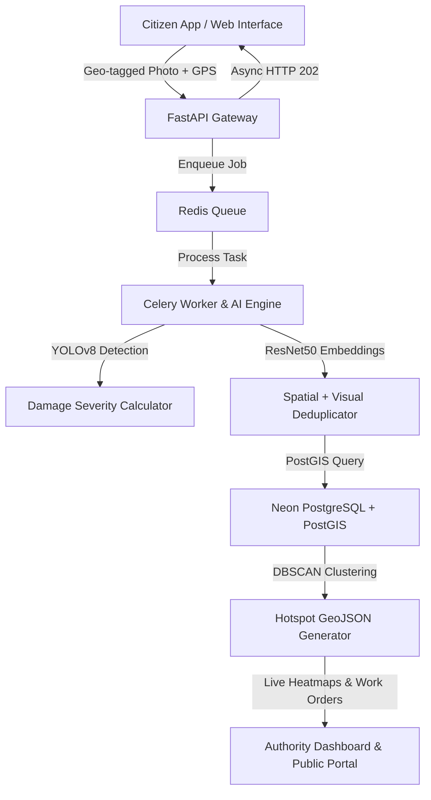

# 🛣️ RoadRuler: Crowdsourced Road Issue Reporter

> **An AI-Enhanced Civic-Tech Platform for Urban Infrastructure Management**

[](#)
[](#)
[](#)
[](#)

---

## 📌 Project Context & Overview

Urban road infrastructure in developing nations faces severe challenges with potholes, waterlogging, damaged surfaces, and broken streetlights going unaddressed for weeks due to fragmented, manual complaint systems. 

**RoadRuler** is a location-aware, image-driven civic-tech ecosystem that bridges the gap between citizens experiencing road hazards and municipal authorities (Ward Officers, PWD, NHAI). By integrating **computer vision AI**, **spatial proximity deduplication**, **DBSCAN hotspot clustering**, **automated jurisdiction routing**, and **SLA escalation tracking**, RoadRuler transforms reactive complaint ticketing into proactive, data-driven municipal infrastructure management.

---

## 🏗️ System Architecture



---

## 🔥 Key System Features

### 1. 📱 Citizen Reporting & Tracking
* **Geo-Tagged Evidence Collection:** Automatic device GPS extraction and Leaflet.js interactive pin picker.
* **Real-Time Complaint Tracker:** Live status timeline tracking complaint lifecycle (`Received` $\rightarrow$ `Processing` $\rightarrow$ `Assigned` $\rightarrow$ `In Repair` $\rightarrow$ `Resolved`).
* **Authentication:** Seamless login and session management powered by **Clerk**.

### 2. 🧠 AI Processing Engine (`ai_engine/`)
* **Automated Hazard Detection:** Multi-class damage classification (Potholes, Waterlogging, Longitudinal/Transverse/Alligator Cracks) using **YOLOv8**.
* **Severity Scoring Engine:** Dynamic priority ranking (Critical / Moderate / Minor) based on damage area ratio and class weights.
* **Spatial & Visual Deduplication:** Combines PostGIS 15-meter spatial proximity radius checks with **ResNet50 Cosine Similarity** to merge duplicate citizen complaints into upvotes.

### 3. 🗺️ Geo-Spatial Intelligence & Hotspots
* **DBSCAN Clustering:** Group dense spatial complaint clusters ($\varepsilon = 50\text{m}$) into actionable municipal work zones.
* **Interactive Heatmaps:** Dynamic GeoJSON heatmap visualization for Ward Officers to prioritize road resurfacing projects.

### 4. ⚖️ Municipal Routing, SLA & Transparency
* **Jurisdiction Auto-Routing:** Spatial polygon intersection (`ST_Intersects`) routing complaints to correct wards or arterial agencies (PWD / Traffic Police).
* **Automated SLA Escalation:** Periodic Celery Beat worker checking SLA deadlines (Critical: 48h, Moderate: 7d) and escalating unaddressed tickets to higher-level authorities.
* **Public Transparency Portal:** Real-time city-wide resolution rates, average response times, and public accountability metrics.

---

## 🛠️ Technology Stack (100% Free & Open Source)

| Layer | Framework / Technology | Purpose |
| :--- | :--- | :--- |
| **Frontend UI** | **Vite + React**, TailwindCSS | Modern, responsive web interface |
| **Maps & Spatial Render** | **Leaflet.js**, OpenStreetMap | Free interactive maps & heatmap layers |
| **Auth** | **Clerk Auth** | Passwordless, Google OAuth, JWT authentication |
| **Backend API** | **FastAPI (Python)** | High-performance asynchronous REST API |
| **Database** | **PostgreSQL + PostGIS** (Neon DB) | Spatial geometry indexing & spatial queries |
| **Async Queue** | **Celery** + **Redis** | Asynchronous ML inference & SLA worker |
| **Computer Vision** | **Ultralytics YOLOv8**, OpenCV | Real-time road damage detection |
| **Deduplication** | **PyTorch (ResNet50)** | Feature vector extraction & Cosine similarity |
| **Spatial Analytics** | **scikit-learn (DBSCAN)** | Density-based hotspot clustering |

---

## 📂 Repository Directory Layout

```
d:\roadruler\
├── frontend/             # Vite + React Citizen & Authority Web Application
├── backend/              # FastAPI Application Server & API Routes
├── ai_engine/            # YOLOv8 Inference, ResNet Embedding, DBSCAN Clustering
├── docs/                 # Production Documentation, Logs & Deliverables
│   ├── daily_log/        # Daily timestamped activity logs for Milin, Utkarsh, & Sankalp
│   └── deliverables/     # Master schedule, integration tests, & individual checklists
└── .agents/skills/       # Custom repository skills for automated agent logging
```

---

## 👥 Team & Responsibilities

* **Milin Kanu (`frontend/`):** Citizen UX, Authority Dashboard, Leaflet Maps, Clerk Auth Integration.
* **Utkarsh Mishra (`backend/`):** FastAPI Core API, Neon PostGIS Schema, Routing Engine, SLA Worker.
* **Sankalp Pandey (`ai_engine/`):** YOLOv8 Training & Inference, Severity Scoring, Visual Deduplication, DBSCAN Engine.
* **Faculty Guide:** Mrs. Shradha Birje
* **Institute:** Thakur College of Engineering & Technology (Autonomous)

---

## 🚀 Quick Start Guide

### Prerequisites
* **Node.js** v18+
* **Python** v3.10+
* **Redis** server (local or Docker container)

### 1. Clone & Set Up Workspace
```bash
git clone https://github.com/sankalp771/roadruler.git
cd roadruler
```

### 2. Backend Setup
```bash
cd backend
python -m venv venv
source venv/bin/activate  # On Windows: venv\Scripts\activate
pip install -r requirements.txt
uvicorn app.main:app --reload
```

### 3. Frontend Setup
```bash
cd frontend
npm install
npm run dev
```

### 4. Celery Worker Setup
```bash
cd backend
celery -A app.core.celery_app worker --loglevel=info
```

---

## 📜 Development & Anti-Fabrication Guidelines

All changes made to this repository must follow the rules defined in `.agents/skills/doc-logger/SKILL.md`:
1. Every code change must be logged in `docs/daily_log/{developer}/YYYY-MM-DD.md`.
2. All test outputs must be captured from actual terminal execution (zero fabricated data).
3. Deliverable checklists must be updated in `docs/deliverables/individuals/{developer}/deliverables.md`.

---

## 📄 License
This project is open-source under the [MIT License](LICENSE).
